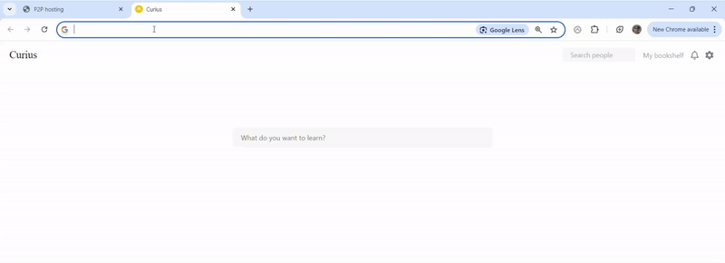

<p align="center">


<a href="https://twitter.com/intent/tweet?text=An+unkillable%2C+browser-based+p2p+network.&url=https%3A%2F%2Fgithub.com%2FElijah-Bodden%2FMembrane&hashtags=webrtc+opensource+p2p+peer2peer+github+projectMembrane&original_referer=http%3A%2F%2Fgithub.com%2F&tw_p=tweetbutton" target="_blank">
  </img>
</a>
</br>
<a href = https://github.com/Elijah-Bodden/Membrane/blob/main/docs.md>

</a>
<a href ="https://membranexus.com">

</a>
</br>
Robust browser-based peer to peer networks  
</br>
<i>Happily announcing Membrane v2 with overhauled developer experience and reliability!</i>
</br>

## What's this?
Membrane is a protocol that takes WebRTC signalling to the browser with living peer networks. With minimal server-based bootstrapping, it makes self-sufficient peer-to-peer networks that can operate without servers. Any member browser can create a connection to any other by signaling across its peers, avoiding clumsy, centralized signaling servers. The network automatically stabilizes its topology and coordinates using broadcast "gossip".

Designed to be agnostic and easy to use, membrane is ideal for web clients for distributed chat, hosting, torrenting, computing, and so much more!  
|  |
|:--:|
| *[Membranexus.com](https://membranexus.com), built using Membrane. After a first-contact server signal, clients never need to interact with a server again - all network functions can happen on the peer level.* |  

Membrane leverages `RTCPeerConnection`'s agnosticism about signalling. You could just as well communicate `ICE` connection data through smoke signals or quantum teleportation as through a standard signalling server. In many cases, signaling servers are an unreliable and vulnerable approach. Membrane attempts to implement a better alternative protocol. With each membrane network acting as a giant, decentralized router, unconnected members on opposite sides of the earth can exchange arbitrary data in milliseconds, with no clumsy intermediary server or risk of downtime.

Of course, this approach isn't perfect. The benefits of decentralization are ultimately also the fatal flaw. What it gains in robustness and decentralization, it loses in making spoofing and manipulation easier. A public key ledger for cryptographic signing is WIP, which should largely remedy these issues (it will likely be served up by the signaling server on initial connectioen, which isn't a problem, since new peers can only be added when the server's up). And for non trust-critical operations, the existing implementation should be good enough.  

## Installation and Integation
### Installing the Demo or Building From Source
  #### Prerequisites
  - `npm`
  - `npx`
  - `node.js`  
### 
Paste the following commands into a terminal to build a complete directory structure and initialize the demo on 127.0.0.1:8000 anywhere with the prerequisities installed.
  ```shell
  wget Membrane-current.tar.gz https://github.com/Elijah-Bodden/Membrane/tarball/v2.1.1
  tar xfv Membrane-current.tar.gz --transform 's!^[^/]\+\($\|/\)!Membrane-current\1!'
  cd Membrane-current/src/source/frontend
  npm install
  cd ../server
  npm install
  npm run deploy
  rm ../../../../Membrane-current.tar.gz
  ```
  To kill the pm2 instance this creates, run `npm run kill`. To re-spawn it, run `npm run deploy` in `/src/source/server`.

### Deploying a New First-Contact Signalling Server
Installing the pre-made server from `/src/source/server/index.noStatic.js` is a piece of cake! Just run `npm i membrane-server` at the root of your node project, sit back, and relax while it installs.  
To deploy the server on pm2, run `npm explore membrane-server -- npm run deploy`. To kill the pm2 instance, run `npx pm2 kill`. Now just remember to replace the websocket addresses in your client's config with your new server's.

You will likely also want to set up coturn TURN and STUN servers and replace the addresses in the frontend's `defaultConfig` with those. And since this is a standalone signaling server, you'll have to serve your frontend (in the demo's case, `/src/source/frontend/dist`) separately.
### Build Your Own App!
Using the library for your own use-case is relatively simple. Here's a typical integration process. Find the delivery method you like below, then head down below to the general next steps  
| Delivery Method | Instructions |
---- | ----
| npm + Webpack | Run `npm install @elijah-bodden/membrane \| cd node-modules/elijah-bodden/membrane` in the root of your webpack project |
| HTML script tag | Go to the directory you serve static files from and find where you want to save the script. Run `wget https://raw.githubusercontent.com/Elijah-Bodden/Membrane/main/lib/index.js -o membrane.js`, and finally paste `<script src="/path/to/membrane.js"/>` into your HTML head. |
| Jsdelivr CDN (recommended) | Simply paste this tag into your HTML head: `<script src="https://cdn.jsdelivr.net/npm/@elijah-bodden/membrane@2.1.4/index.js"></scrípt>` |

<p align=center><i>then</i></p>

<!--List Break-->
Now comes the fun part - building the thing! You'll likely want to set up your own first-contact signaling server (like [this](https://github.com/Elijah-Bodden/Membrane#deploying-a-new-signalling-server)) and host it publicly so people can use your app from all different networks. Don't forget to edit the websocket urls in `CONFIG.serverLink` to point to it (or pass a config loader into init and do that without editing the source - how to do that next)!

The library has lots of things to play with, but here are some of the most useful for high-level apps. Read the [docs](https://github.com/Elijah-Bodden/Membrane/blob/main/docs.md) to find out how to use them!: `init`, `gossipTransport.addType`, `gossipTransport.addParser`, `*.addGossip`, `networkMap.nodes`, `livePeers`, `authPeers`, `CONFIG`, `deauthPeer`, `onAuthRejected`, `onServerError`, `onNewAuthPeer`, `onNewPeer`, `onLostAuthPeer`, `onLostPeer`, `sendConsumable`, `onAuth`, `makeConnection`, `onNetworkMapUpdate`, `onConsumable`
#### Custom App Demo
Here's a small demo that shows off how to build an app on membrane. It's a tiny distributed self-hosting platform, where clients can publish resources (for example websites) and advertise them to the rest of the network through a custom gossip transport. If a peer wants a resource, it creates an auth route to the target, and the two use an ad-hoc `consumable` formatting method to handle request and response. Notably this is all peer-to-peer - aside from a tiny signaling server (which is only needed for adding new members), it should be able to scale infinitely without hardware overhead. The actual structure of the network is screened off from the user, so as far as they're concerned, they're directly connected to every single node. It runs on vanilla Membrane with a standard signalling server. With redundant hosting, this could be fleshed out into a pretty usable p2p version of the web or a social media. Here's the demo in action:  





And here's the code
```js
// index.js
var selfHostingTransport
var resourceLocations = {}
var myResources = {}
document.addEventListener("DOMContentLoaded", function() {
    resourceList = document.getElementById("resource-list")
    resourceDisplay = document.getElementById("resource-display")
})

async function configLoadFunction() {
    return {
            "serverLink.initBindURL": "ws://localhost:8777/bind?originatingSDP=*",
            "serverLink.reconnectURL": "ws://localhost:8777/reconnect",
            "communication.publicAlias": "Random person",
        }
}

// Can only add gossip transports after init
init(configLoadFunction).then(async () => {
    // This transport will broadcast each peer's content list
    selfHostingTransport = gossipTransport.addType("contentList");
    // When we get gossip about content lists, edit our content list
    gossipTransport.addParser(
        "contentList",
        // Means we use the default pre-parser. Automatically handles passing gossip along for us
        true,
        // block = all gossip; commitable = all gossip, but only the "constantParameter" fields - ones that the transport uses to decide if gossip is new; unknown = all new gossip
        async function (_block, _committable, unknown) {
            unknown.forEach((fact) => {
                if (networkMap.nodes[fact.alias]) {
                    resourceLocations[fact.alias] = fact.content
                    // Rerender resource list if it's currently visible
                    reRenderResourceList()
                }
            });
        },
        // constantParameters - in this case each gossip has a uniqe ID to make sure it doesn't circulate the network infinitely
        ["UID"]
    );
})

onNetworkMapUpdate((kind, info) => {
    // Will be a tuple of aliases if it's an edge change, but we're only interested in node changes
    let alias = info
    if (kind === "addNode") {
        // Add a content tracker for every new node
        resourceLocations[alias] = []
    }
    if (kind === "removeNode") {
        // Delete our tracker for a node's content when it leaves
        delete resourceLocations[alias]
    }
    // Rerender the resource list every time the network map updates
    // If the DOM hasn't loaded yet, we'll have to wait until it does
    if (!document.body) {
        document.addEventListener("DOMContentLoaded", () => {
            reRenderResourceList()
        })
        return
    }
    reRenderResourceList()
});

onNewAuthPeer((alias) => {
    // Give it a callback for consumable packages
    onConsumable(alias, (request) => {
        // If it's a lookup request (defined by our arbitrary formatting protocol), give a response
        if (request.startsWith("lookup: ")) {
            lookupResponse(alias, myResources[request.slice(8)])
        }
        else if (request.startsWith("resource: ")) {
            // And render if it's a lookup response
            renderResourceDisplay(request.slice(9))
        }
        else {
            console.error("Unknown consumable package: " + request)
        }
    })
})

async function lookupRequest(alias, location) {
    if (alias === CONFIG.communication.hiddenAlias) {
        renderResourceDisplay(myResources[location])
        return
    }
    // Make a route to the resource host if we don't already have one. This is screened off from the user.
    // If we already have a connection, this will do nothing
    await makeConnection(alias, true)
    onAuth(alias, () => {
        sendConsumable(alias, "lookup: " + location)
    })
}

async function lookupResponse(alias, resource) {
    sendConsumable(alias, "resource: " + resource)
}

async function publishResource(location, resource) {
    // Add the resource to our list
    myResources[location] = resource
}

// Broadcast our resource list every 1 second
setInterval(() => {
    selfHostingTransport.addGossip({alias: CONFIG.communication.hiddenAlias, content: Object.keys(myResources), UID: Math.random().toString().slice(2, 17)})
}, 1000);

function renderResourceList() {
    resourceList.innerHTML = ""
    resourceDisplay.innerHTML = ""
    for (let i in resourceLocations) {
        resourceList.innerHTML += `<p>${hiddenAliasLookup[i]}</p><ul>`
        for (let j of resourceLocations[i]) {
            resourceList.innerHTML += `<li><a href="#" onclick="lookupRequest('${i}', '${j}')">${j}</a></li>`
        }   
    }
}

function renderResourceDisplay(resource) {
    resourceDisplay.innerHTML = resource
    resourceList.innerHTML = ""
    resourceDisplay.innerHTML += "<br><button onclick='renderResourceList()'>Back</button>"
}

function reRenderResourceList() {
    if (resourceList.innerHTML !== "") {
        renderResourceList()
    }
}
```
```html
<!-- index.html -->
<!DOCTYPE html>
<html lang="en">
    <head>
        <meta charset="UTF-8">
        <meta http-equiv="X-UA-Compatible" content="IE=edge">
        <meta name="viewport" content="width=device-width, initial-scale=1.0">
        <title>P2P hosting</title>
        <script src="https://cdn.jsdelivr.net/npm/@elijah-bodden/membrane@2.1.3/index.js" type="text/javascript"></script>
        <script src="index.js"></script>
    </head>
    <body>
        <h1>P2P self-hosting</h1>
        <div id="resource-list">(No sites up right now)</div>
        <div id="resource-display"></div>
        <textarea id="resource-writer" rows="5" cols="50" placeholder="Your site"></textarea>
        <textarea id="name-field" rows="1" cols="10" placeholder="Site name"></textarea>
        <button onclick="publishResource(document.getElementById('name-field').value, document.getElementById('resource-writer').value)">Publish</button>
    </body>
</html>
```
## Contributing
I appreciate any contributions! If you see something you think you can improve in the code, please make a PR. If you just have an idea or spot a bug, that's great too! Please, open an `issue` with either the `bug` or `enhancement` tag. And if you just want to show some love to the project, it'd mean a ton if you left a star!  
## Authors
* **Elijah Bodden** - *Initial work* - [Elijah-Bodden](https://github.com/Elijah-Bodden)
## License
MIT License. See the [LICENSE](LICENSE) file for details.

## Built With
- The core module - 100% [Vanilla.js](http://vanilla-js.com/). Also check out [kNow](https://github.com/Elijah-Bodden/kNow), which I spun off of membrane's homebrew event handler.
- Demo frontend - HTML/SCSS/JS (because i'm stupid), plus [Sigma.js](https://github.com/jacomyal/sigma.js)+[Graphology](https://github.com/graphology/graphology) to power the gorgeous network visualization graph (and some pretty Font Awesome icons!)
- Backend - [Node](https://github.com/nodejs/node) using lots of libraries, but especially [Winston](https://github.com/winstonjs/winston) for logging and [WS](https://github.com/websockets/ws) for websockets

## Contact
Elijah Bodden - elijahbodden@protonmail.com / admin@membranexus.com  
Project - https://github.com/Elijah-Bodden/Membrane  
