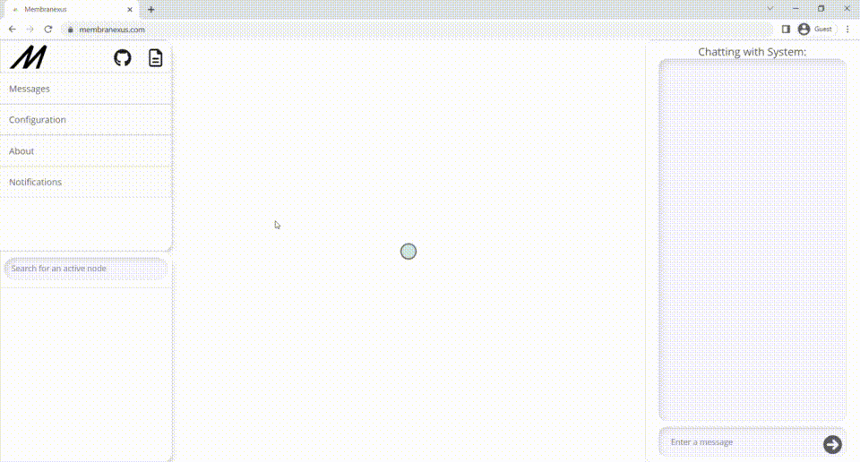

<p align="center">


<a href="https://membranexus.com">

</a>

<a href="https://twitter.com/intent/tweet?text=An+unkillable%2C+browser-based+p2p+network.&url=https%3A%2F%2Fgithub.com%2FElijah-Bodden%2FMembrane&hashtags=webrtc+opensource+p2p+peer2peer+github+projectMembrane&original_referer=http%3A%2F%2Fgithub.com%2F&tw_p=tweetbutton" target="_blank">
  </img>
</a>
</br>
<a href = https://github.com/Elijah-Bodden/Membrane/blob/main/docs.md>

</a>
<a href ="https://membranexus.com">

</a>
</br>
Robust, minimal-server-interaction peer routing in the browser
</br>
Note: much of this repo is production materials. If you're looking for the actual library source, you can find it <a href="https://github.com/Elijah-Bodden/Membrane/blob/main/lib/index.js">here</a>.
</p>

## What  is this?
The Membrane protocol takes signalling to the browser, creating living peer networks. With minimal server-based bootstrapping, it can create self-sufficient WebRTC peer networks with full self-signaling abilities. The network acts as a giant signaling *membrane*, connecting even the most distant peers quickly, without the need for a server. So long as a node remains a part of the network, it has full contact with every participant. Meanwhile, the network actively stabilizes, minimizing heuristics like minimum node distance to ensure a healthy, well-connected network and giving a seamless "immediate-access-to-anyone" experience.
|  |
|:--:|
| *[Membranexus.com](https://membranexus.com), built using Membrane. After each node's first connection, it never again needs the server to help it connect to other nodes or communicate network information. Its peers do both instead.* |  

Membrane leverages the `RTCPeerConnection` API's agnosticism about signalling. You could just as well communicate `ICE` connectivity data through smoke signals or quantum teleportation as through the standard signalling server. In fact, in many cases, signaling servers prove a terribly unreliable, vulnerable approach approach. And so, Membrane attempts to implement a better, alternative protocol. With each membrane acting as a giant, decentralized routeter, distant, unconnected members can exchange arbitrary data in milliseconds with no clumsy intermediary server or risk of downtime.

However, this approach is not perfect. The benefits of decentralization are ultimately also the project's fatal flaw. No centralized ledger to authenticate peers means spoofing, posing, and general manipulation are simple. 

In brief, this tool is robustly functional at enabling anonymous, homogeneous, untrusted data exchange, but poor for situations where peer identity is critical.

## Installation and Integation
### Installing the Demo or Building From Source
  #### Prerequisites
  - `npm`
  - `npx`
  - `node.js`  
### 
Paste the following commands into a terminal to build a complete directory structure and initialize the demo on 127.0.0.1:8000 anywhere with the prerequisities installed.
  ```shell
  curl -LJo Membrane-current.tar.gz https://github.com/Elijah-Bodden/Membrane/tarball/v1.0.5
  tar xfv Membrane-current.tar.gz --transform 's!^[^/]\+\($\|/\)!Membrane-current\1!'
  cd Membrane-current/src/source/frontend
  npm install
  cd ../server
  npm install
  npm run deploy
  rm ../../../../Membrane-current.tar.gz
  ```
  To kill the pm2 daemon created by `npm run deploy`, run `npm run kill`.
  
  However, although this demo functions, this does not mean it should be used in production. It is a quick-and-dirty demonstration of the library's abilities, not made for any serious scalable production situation. quoting `./src/source/frontend`'s "`PLEASENOTE.md`", 
  >Excluding the included `lib` code, the vast majority of the code within this directory and its descendants should never see the light of serious production. It was hastily coded to fit its closed use case. This is nothing more than a demo of the library—far out-of-scope of this project's goal. Please do not treat it as a true part of Membrane. The project begins and ends at `lib`.  
TL;DR: This code is a great risk to the performance and stability of your frontend. Unlike `lib`, it was not intended as a viable product, and shouldn't be used like one.
### Deploying a New Signalling Server
Installing the pre-made server from `/src/source/server/index.noStatic.js` is a piece of cake! Simply enter the following into a terminal while in the root of your node project, sit back, and relax while the project installs.
```bash
npm i membrane-server
```
Then, to deploy the server over pm2 onto websocket port 8777, enter `npm explore membrane-server -- npm run deploy`. Simmilarly, to kill the instance created by this command, run `npm explore membrane-server -- npm run kill`. Now just remember to replace the signalling addresses in your `lib` script's config with your new server's, and you're ready to go.
### Custom Applications
Using the vanilla `lib` module in a custom use-case is relatively simple. Here is an overview of the typical integration process. First, find the delivery method you like below, then, after you've completed its unique instructions, head down below to the general next steps  
| Delivery Vector | Instructions |
---- | ----
| npm + Webpack | Run `npm install @elijah-bodden/membrane \| cd node-modules/elijah-bodden/membrane` in the root of your webpack project<sup id="a1">[ \[1\]](#f1)</sup>|
| HTML script tag | Enter your project's static file directory, find where you'd like to store the script, then run `wget https://raw.githubusercontent.com/Elijah-Bodden/Membrane/main/lib/index.js -o membrane.min.js`. Then insert within your HTML `head` the following tag: `<script src="/path/to/membrane.min.js"/>`. From here, return to the folder where you installed the script and follow the instructions found after this table |
| Jsdelivr CDN (not recommended) | With this method, you will not need to follow the general instruction which come after the table; however, you will be stuck with the default config and every peer request will be accepted by default. If you wish to proceed, knowing this, simply prepend the following tag to your HTML `head`'s contents. `<script src="https://cdn.jsdelivr.net/npm/@elijah-bodden/membrane/index.min.js"` |

<p align=center><i>then</i></p>

1. (optionally) Modify your script's `CONFIG.communication.configLoaderFunction` as needed in [this](https://github.com/Elijah-Bodden/Membrane/blob/main/docs.md#loading-custom-configurations) form.
2. (optionally) Create a `CONFIG.communication.routeAcceptHeuristic` either statically in `defaultConfig` or dynamically at runtime through `CONFIG.constants.configLoadFunction`. If you want to allow the user to explicitly accept certain routes, you can include an awaited async function which fetches user responses.
<!--List Break-->
At this stage, the script should be capable of standalone function. To verify, serve several instances of it into any relatively-recent `window`-based environment (i.e. a browser) with the [default server](https://github.com/Elijah-Bodden/Membrane#deploying-a-new-signalling-server). If an instance's `livePeers` variable contains at least one `Object`, everything's working.  
Then, to interact with the modlue:
- Use `negotiateAgnosticAuthRoute` on members of `Object.keys(networkMap.nodes)` to authenticate arbitrary nodes.
- Use `* Authenticated Peer *.standardSend("consumable", *arbitrary data*)` to send consumable data to authenticated peers.
- Define an output for consumable data with `onConsumableAuth((_dontUse, data) => {* useData *(data)})`.
- Provide initial connect and reconnect websocket urls in `CONFIG.serverLink`.
- Set up a signaling server with the appropriate endpoints and exchange methods (or use the [included](https://github.com/Elijah-Bodden/Membrane#deploying-a-new-signalling-server) one)  
###
___
<b id="f1">1 </b>The following items are able to be imported from the npm module: `CONFIG`, `GossipTransport`, `authPeers`, `deauthPeer`, `defaultConfig`, `detatchedRoute`, `eventHandler`, `eventHandlingMechanism`, `gossipTransport`, `hiddenAliasLookup`, `init`, `initialReferenceLedger`, `livePeers`, `loadConfig`, `mostRecentServerHeartbeat`, `networkMap`, `networkMap`, `onAuthRejected`, `onLivePeersUpdated`, `onPublicError`, `peerConnection`, `pubAliasLookup`, `pubAliasUnparser`, `routingTableTransport`, `serverHardRestart`, and `topologyTransport`. [↩](#a1)
## Contributing
Any and all contributions are greatly appreciated. If you want to see this project grow like I do, there are several ways to help. Firstly, if you see something you think you can improve in the code, please `fork` the repository and make a `pull` request once you have made any changes you'd like to see. If you just have an idea, or spot a bug, that's great too! In this case, please file an `issue` with a corresponding `bug` or `enhancement` tag. Oh, and if you like what you see here, please feel free to leave a star on the project, it would mean a ton to me.
## Authors
* **Elijah Bodden** - *Initial work* - [Elijah-Bodden](https://github.com/Elijah-Bodden)
## License
This project is licensed under the MIT License. See the [LICENSE](LICENSE) file for details.

## Built With
- The core module - 100% [Vanilla.js](http://vanilla-js.com/). Additionally, check out [kNow](https://github.com/Elijah-Bodden/kNow), which I spun off of the homebrew event handler made for use in Membrane.
- Frontend - Standard HTML/SCSS/JS, plus [Sigma.js](https://github.com/jacomyal/sigma.js)+[Graphology](https://github.com/graphology/graphology) to power the gorgeous network visualization graph (and a pinch of Font Awesome for icons)
- Backend - JS on [node](https://github.com/nodejs/node) using, most notably, [Winston Logger](https://github.com/winstonjs/winston) for logging and [WS](https://github.com/websockets/ws) as a WebSocket server

## Contact
Elijah Bodden - elijahbodden@protonmail.com / admin@membranexus.com  
Project - https://github.com/Elijah-Bodden/Membrane  
